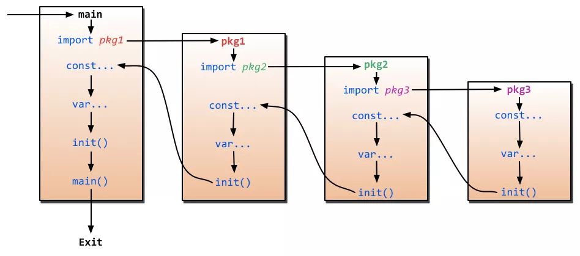

# 16

关于init函数，下面说法正确的是（ ）

A. 一个包中，可以包含多个init函数；
B. 程序编译时，先执行依赖包的init函数，再执行main包内的init函数；
C. main包中，不能有init函数；
D. init函数可以被其他函数调用；

```shell
A、B
```

解析：
- init()函数是用于程序执行前做包的初始化的函数，比如初始化包里的变量等；
- 一个包可以出现多个init()函数，一个源文件也可以包含多个init()函数；
- 同一个包中多个init()函数的执行顺序没有明确的定义，但是不同包的init函数是根据包导入的依赖关系决定的；
- init函数在代码中不能被显示调用、不能被引用（赋值给函数变量），否则出现编译失败；
- 一个包被引用多次，如A import B，C import B，A import C，B被引用多次，但B包只会初始化一次；
- 引入包，不可出现死循环。即A import B，B import A，这种情况下编译失败；

